LoD3 Modeling based on Mobile Laser Scans
=========================================

Preliminary
-----------

Software
^^^^^^^^

Requirements

- `SketchUp Make 2017 (or newer/Pro) <https://www.sketchup.com/download/all>`_
- `CityEditor plugin <https://extensions.sketchup.com/de/content/cityeditor-2>`_

Useful Plugins

- `curic Mirror <https://extensions.sketchup.com/extension/72c3aa60-da8e-4a56-9f70-ab4bc706060c/curic-mirror>`_
- `place Shapes <https://extensions.sketchup.com/extension/391ea6ea-9f03-4e5a-bdaf-219cda9817ee/place-shapes-toolbar>`_
- `1001bit tools <https://extensions.sketchup.com/extension/e5b1211a-8d1a-4813-bdc3-b321e5477d7b/1001bit-tools-freeware>`_
- `Eneroth Town House System <https://extensions.sketchup.com/extension/4e904d46-751d-4ecc-9ea0-3bb0807de322/eneroth-townhouse-system>`_

Input data
^^^^^^^^^^^^
Within this workflow pipeline following datasets were used:

- XYZ (simplified pointcloud =< 150 000 points to assure SketchUp efficiency)
- CityGML (selected input LoD1 to simplify modeling tasks later on)
- *possibly* already created adjacent LoD3 buildings

Data import
-----------

After installing and activating SketchUp and the CityEditor plugin, the import of datasets is possible.
Select *CityEditor Importer* to run the importing window.

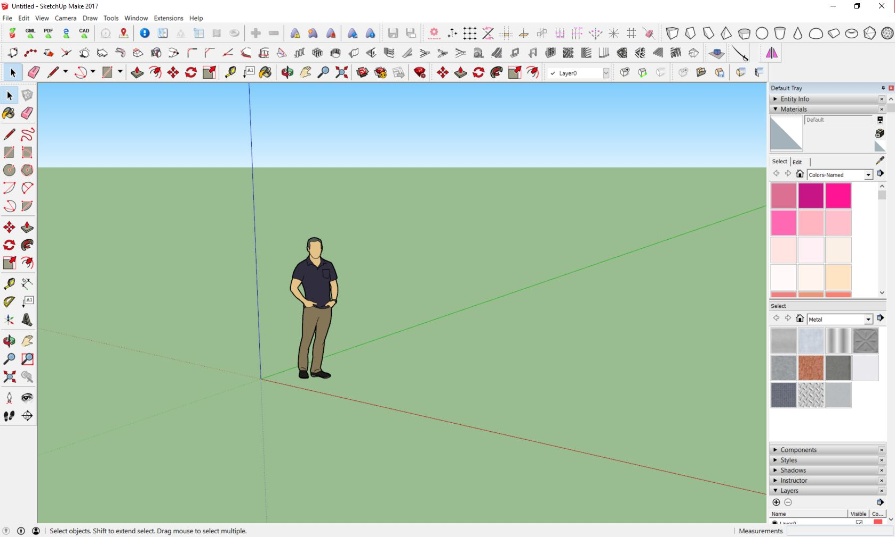

Click on the building icon at the top-right to add CityGML objects (formats like .xml, .gml, .shp, .dxf, and other avalaible). It is possible to add single files (under *File...*) or several (*Directory...*).

After a successful selection, the building dataset should be listed in the gray area of a window.

A similar operation should be performed for adding point clouds. The plugin allows to add point clouds **only in .xyz or .csv format** and **number of points should be lower than 200 000** (for **best performance =<150 000** were used within this tutorial). Instead of building an icon you should choose a small squares icon, second from bottom-right. Again, there is an option to add a single object or a whole directory.

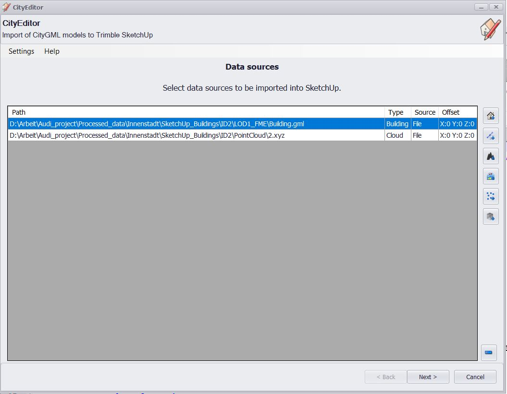

Click *Next*. Then, in section *Preparsing* click *Next* again to pre-validate your data. Depending on data it can take to several minutes, the process can be tracked in the process bar.
Preparsing results contain information about the model bounding box, width, height and list of errors. At this point, you can check whether your data are in a proper coordinate system and roughly estimate the position of your model.

Click *Next* to proceed.

.. image:: resources/cityeditor_import_preparsing.jpg
    :width: 100%

*Options* window contains 3 sections: *Buildings/CityGML*, *Pointcloud* and *Expert Options*. If more types of datasets are chosen the sections expand accordingly.

Tick the *Highest available* to pick all available LoD within our dataset (in this example number 1 is sufficient for building in LoD1).

To load an appearance of buildings select *Appearance Theme* - in this example there are no textures available.

*Automatic Roof Texturing/Coloring* is set to *None*. However, it is possible to automatically colorize (*Colorize*) Roof surfaces or put a texture (*Texturiz*) based on WMS (like OSM) and buildings coordinates at the rooftop. In the creation of LoD3, it is mostly not relevant.

To import attributes of objects tick *Import Attributes*.

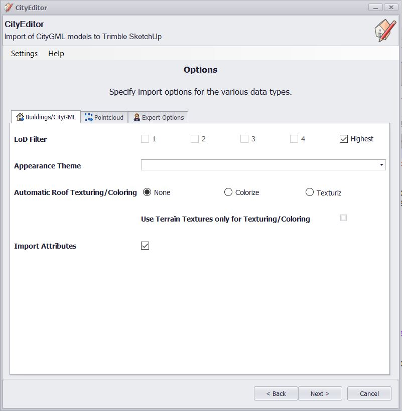

Go to the Pointcloud section now. Here you can select your preferences regarding point cloud representation - plus or cube (*Point Representation*).

Moreover, Point Size in units of a map (meters in this example - depends on the coordinate system of input data) can be set as well as colour (by Height or Natural) and Voxel Size.

Values presented in a screenshot assure good performance and minimize further simplification of point cloud by a plugin.
More about Voxel : (`Voxel on Wikipedia <https://en.wikipedia.org/wiki/Voxel>`_, `CityEditor Manual <https://www.3dis.de/files/cityeditor/downloads/CityEditor_en.pdf>`_
)

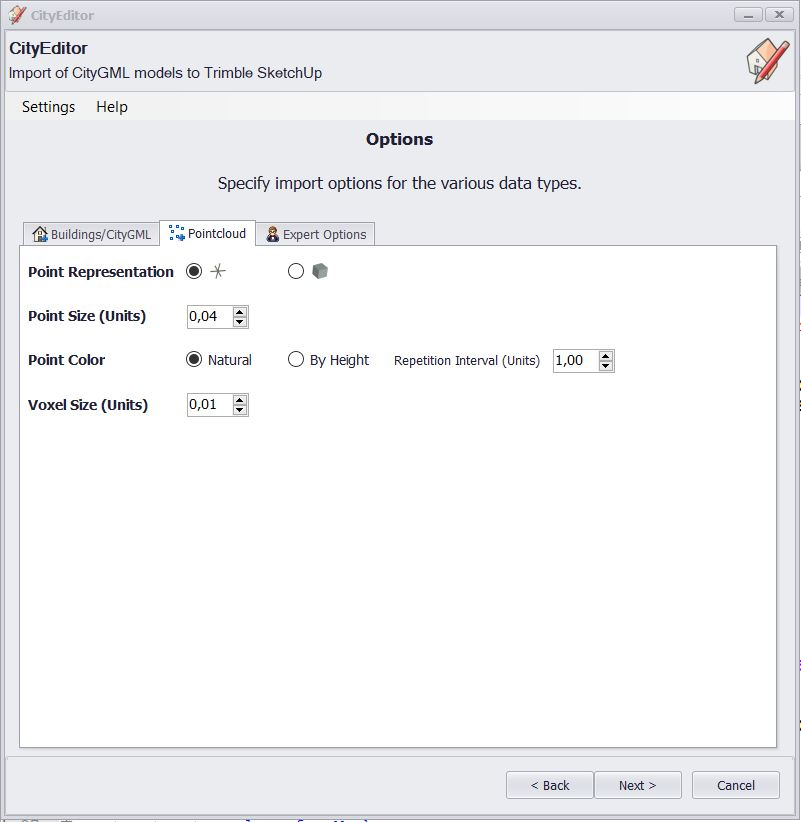

*Expert Options* bar is relevant only if you want to import higher detailed buildings or materials. Also, there is an option to validate GML Namespaces at this point. The default values are sufficient to proceed.

Now, you can click *Next* to continue.

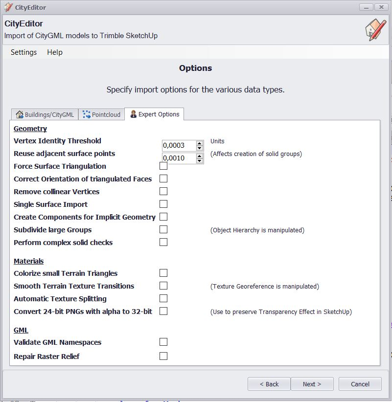

In *Coordinates* window you can check your coordinate system (*Coordinate System* section) or integrate your data with already existing SketchUp project (*Model Integration*) and set timezone (*Timezone*). In this example, the plugin reads everything automatically.

Click *Next* to continue.

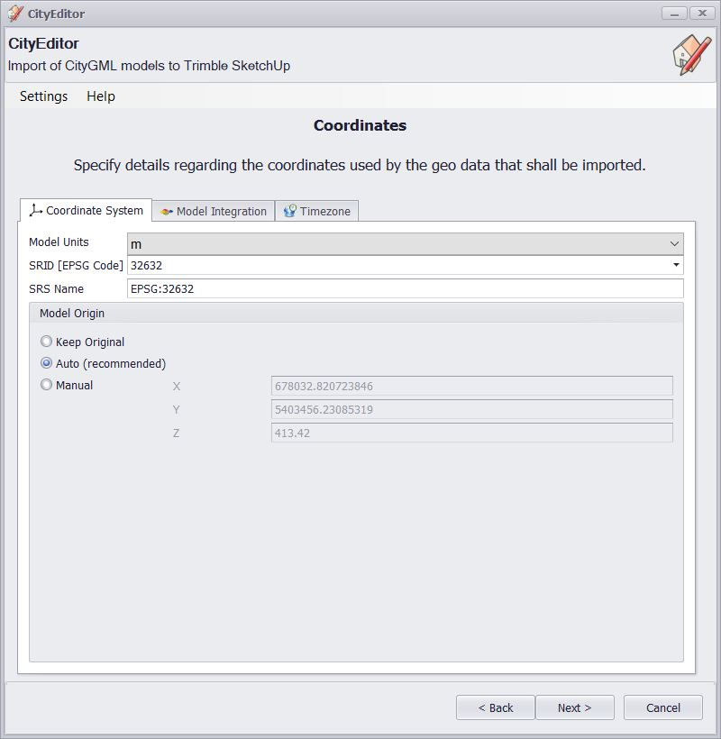

The next window allows us to filter out only relevant data from the whole dataset simply by *Region* or *Gridding* definition. This part also can serve as a preview of data extend thanks to the option of base map selection (*Map Source*), here OpenStreetMap selected.
Filtering at this point is not recommended - it is better to prepare data before importing it to SketchUp.

Click *Next* to continue.

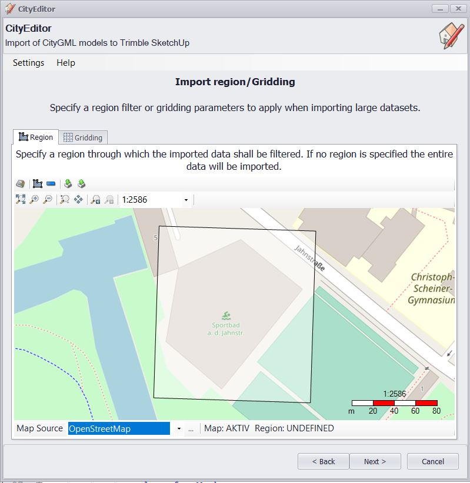

In the following window, you can specify a saving path. You can tick the option below to save log file as text which can be found in the same folder.

Click *Next* and then *Finish* to load data.

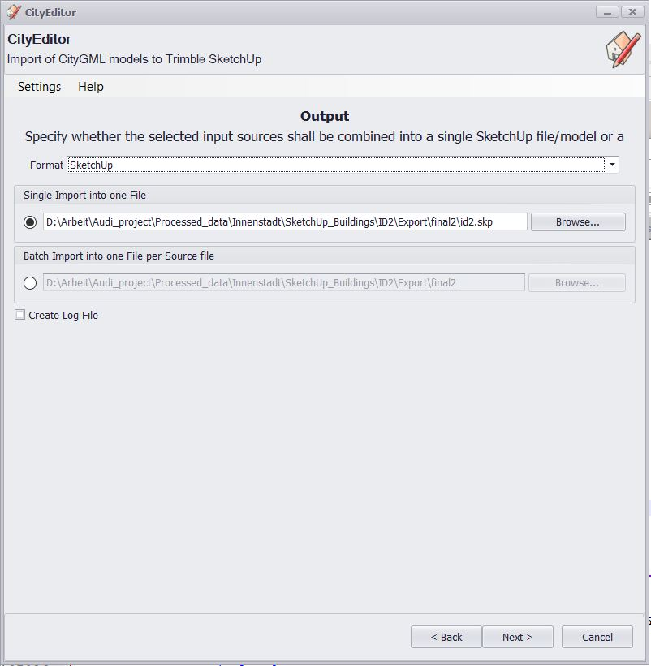

Steps performed by the plugin are displayed in a window.

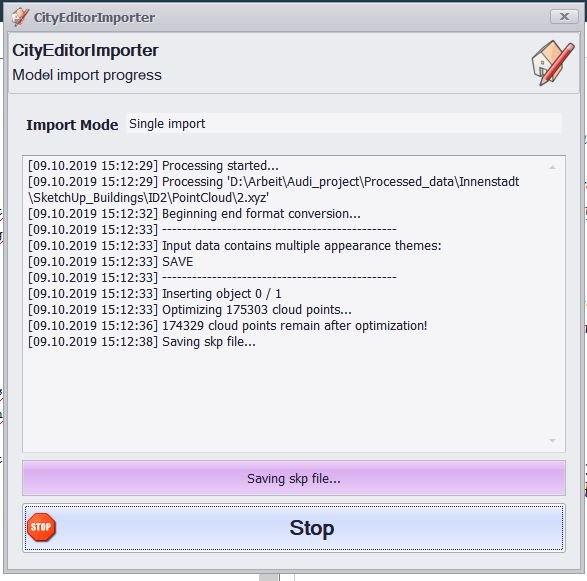

Modeling
---------

The LoD1 building and the point cloud are imported as a starting point for the modeling.  First, it is relevant to copy attributes from the LoD1 building (*Right Click-> Attributes -> Copy to Clipboard*). At the end of objects modeling, the building is merged in a group and the attributes can be reassigned.

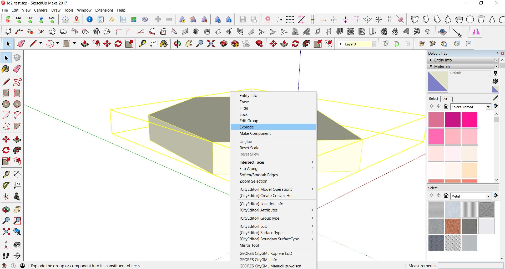
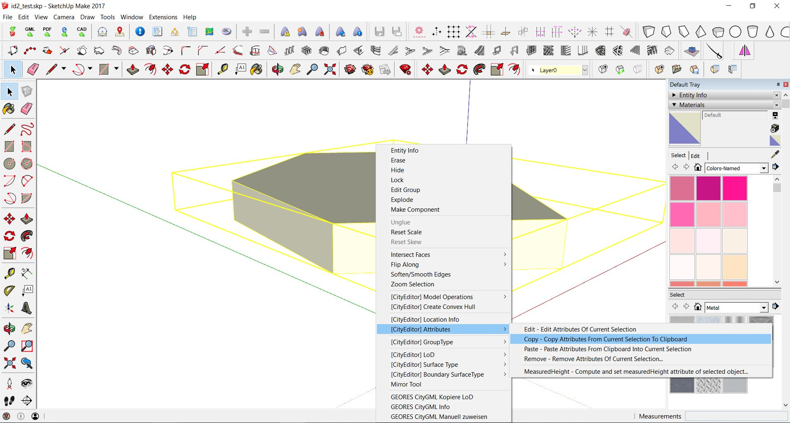

Further modeling should be done with the aid of a point cloud, an external preview of a point cloud and photos or mesh from Google Earth Pro. Additionally, the website `Mapillary <https://www.mapillary.com/app/?lat=20&lng=0.0001&z=1.5&focus=map&mapStyle=Mapillary+satellite>`_ provides crowdsourced street-level images.
Not every part of a building has to be done from scratch. A wide repository is available on SketchUp Warehouse where tiny and big elements can be downloaded.

Moreover, the SketchUp community (SketchUp extensions) offers a lot of plugins tailored to the user's needs. Some of the most interesting for building modeling are:
- *Chris Fullmer Tools, Component Onto Faces*
- *bit tools 1001*
- *Weld*

Walls and ground surface
^^^^^^^^^^^^^^^^^^^^^^^^

The walls and the ground surface are modeled based on the LoD1 building and the point cloud. The layers which are created automatically are *Layer0*, *PointCloud* and *Unclassified.LoD1*. In a later step, when assigning the building components to CityGML, further layers are created automatically. Apart from this, it is not required to create additional layers. *Layer0* should remain the current layer during the modeling.

At the beginning, the layer of the point cloud can be hidden. Click on the LoD1 building and copy it (*Edit -> Copy*) and then paste it (*Edit -> Paste in Place*). Edit the new one with *Double Click*, mark all entities with Double Click and assign them to *Layer0*. Explode the LoD1 building on *Layer0*.

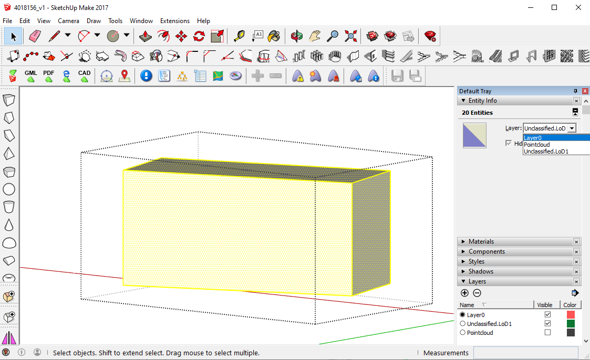

The layer *Unclassified.LoD1* can then be hidden but contains the original LoD1 building as a backup, in case it is needed later. The other one can be changed while modeling the walls and the ground surface.

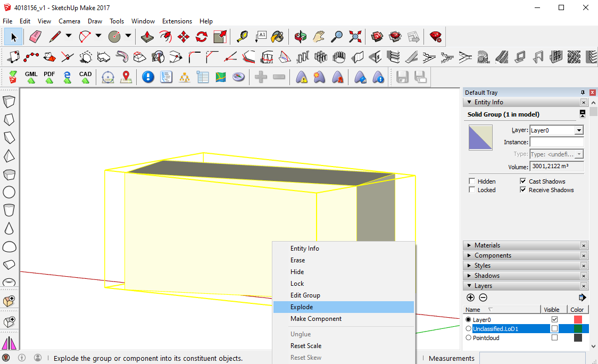

Choose one of the edges of the LoD1 building and position the coordinate system there, so the origin is at the lower corner and the blue axis lies on the vertical edge (*Tools -> Axes*). This is helpful for the modeling, as the edges of the building can now be drawn parallel to the blue axis.

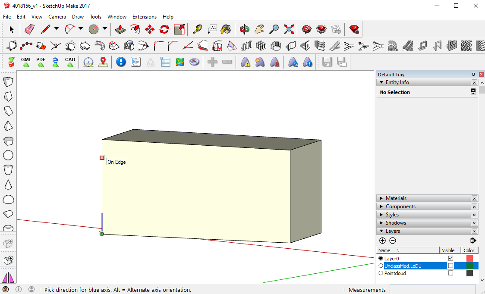

Use the *Circle* tool to draw a coplanar surface for preparing the ground surface. The center of the circle is the origin of the coordinate system from the previous step and the circle is perpendicular to the blue axis.

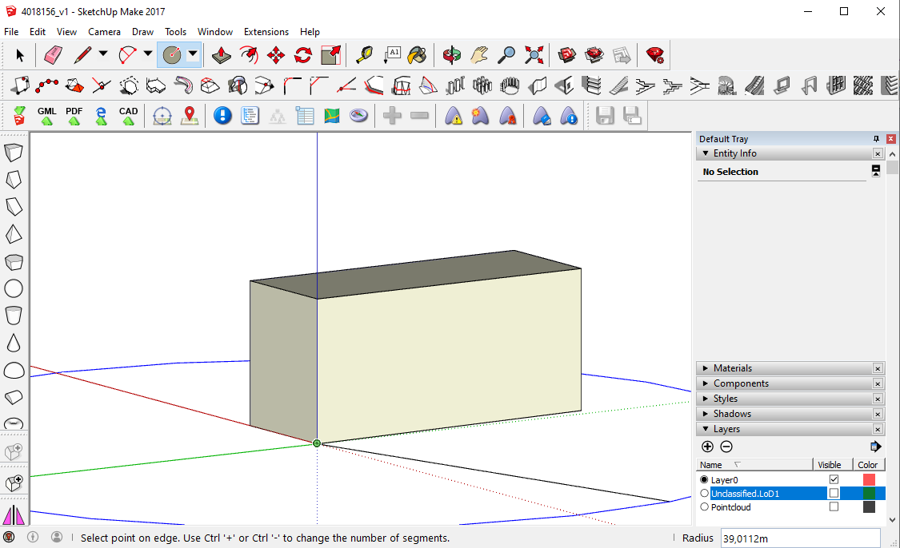

Now use the *Extend Edge to Edge* or *Face* tool for all the building edges, so they reach the circular ground surface. 

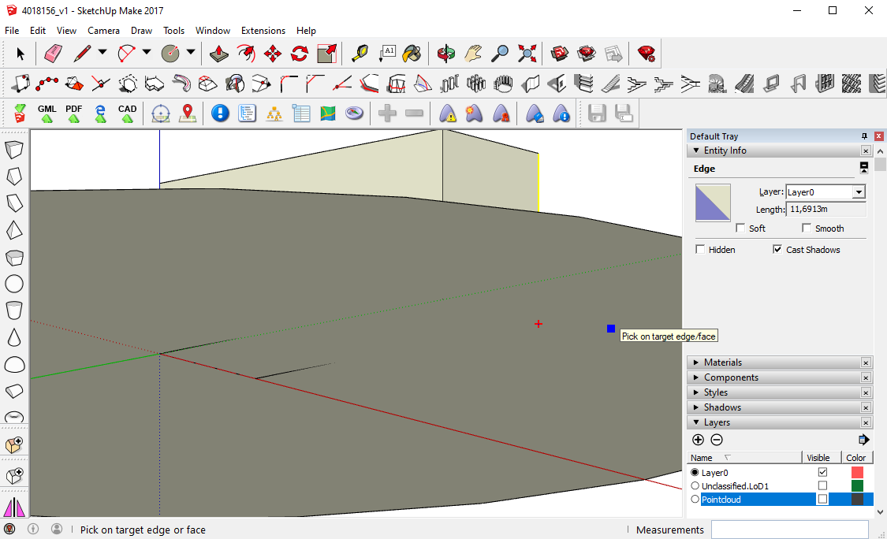

Change the perspective, so you look to the ground surface from underneath and draw lines between the end points of the edges. These lines lie on the ground surface and mark the position of the building edges.

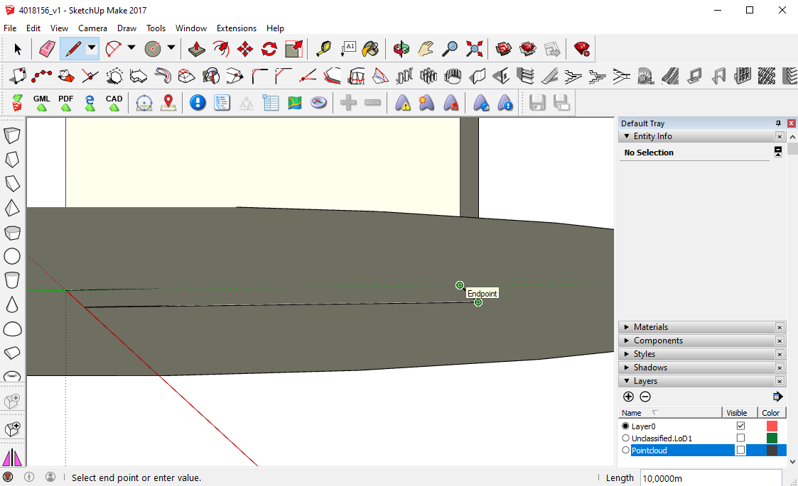

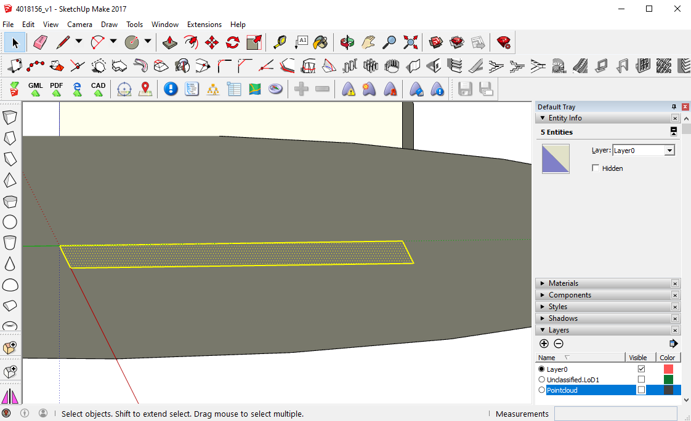

Erase the edges of the exploded LoD1 (on *Layer0*) and the small edges from the *Extend Edges* command, so you have no vertical lines any more, but only the horizontal lines of the ground surface. Also, erase the upper horizontal lines of the exploded LoD1. On *Layer0* only the ground surface and the circular surface are left now. Next, define the level of the ground surface. Therefore, check the point cloud and derive the lowest level of the ground surrounding the building. 

Example for window creation
^^^^^^^^^^^^^^^^^^^^^^^^^^^

To create a detailed window you can create by yourself or use the SketchUp Warehouse. Here, I would like to present an example with a window from SketchUp Warehouse.

Go to a web page of SketchUp Warehouse and find a window by typing "window" in the command line. Remember to select the right version of SketchUp (here, SketchUp 2017).

After that, you can simply open the downloaded file and select whole object and use ctrl+c and paste it into an open building project using ctrl+v.

.. image:: resources/modeling_example_building.jpg
    :width: 100%

Mostly users create such objects as Components or Groups. To assure that the local axis of the imported window is in the right place you can explode window Group/Component (similar to with building in LoD1 before).
After that, you can create Component again and set the local axis - remember that window should later align with a wall or roof on which you will place it.

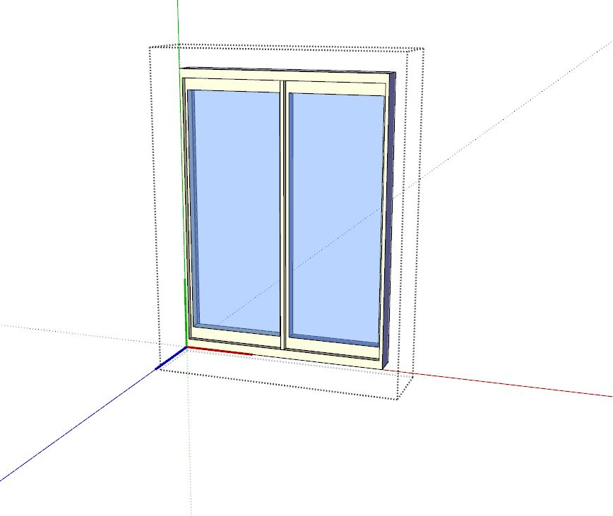

If an axis was properly assigned and a wall is created it is now possible to quickly place the window on the wall. Select the surface and then component and go to *Extensions-> Chris Fullmer Tools, Component Onto Faces*. Thanks to that window is aligned with a wall.

Now you can move and scale it with native *Move* and *Scale* tool. In order to cut an opening for a window the easiest way is to draw a polygon bounding the component and erase a face inside this polygon.

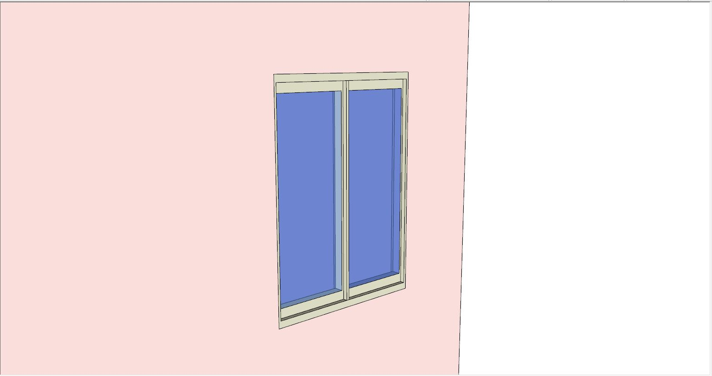

The current object is conformant with SketchUp and aligns the bounding surface properly. However, now it is important to make the window a semantic, CityGML Window.

To do that *Right Click-> [CityEditor.jpg GroupType ->Window*. Then you have to specify what kind of opening is that -  *Right Click-> [CityEditor.jpg Opening Boundary Surface Type ->WallSurface* and at what level of deitails *Right Click-> [CityEditor.jpg LoD -> 3* as well as *Right Click-> [CityEditor.jpg Surface Type ->lodXMultiSurface*.

That is why all groups should be also grouped within the SketchUp project(Windows, BuildingInstallations, etc.). Surfaces like walls, roofs, and ground do not have to be grouped as they can be assigned from a surface position.

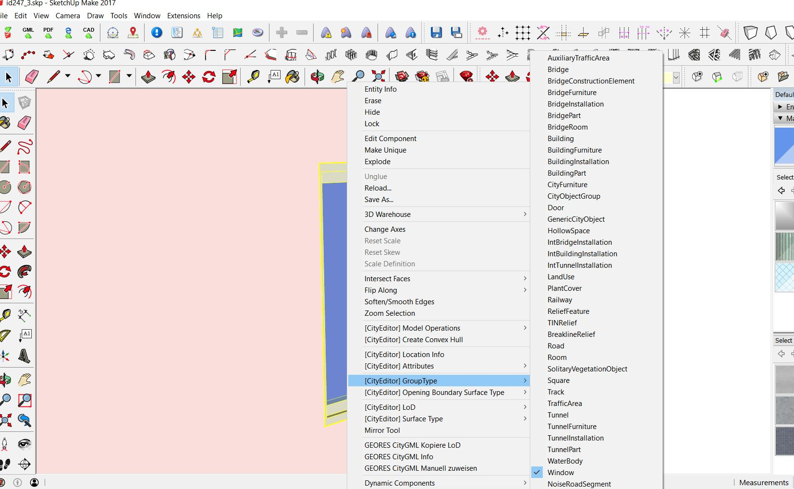

Closing the model
^^^^^^^^^^^^^^^^^

The similar steps have to be done for each new object within SketchUp. To assure CityGML validity each surface has to be assigned to specific CityGML configuration. Useful website: `sig3d.org <http://en.wiki.quality.sig3d.org/index.php/Modeling_Guide_for_3D_Objects_-_Part_2:_Modeling_of_Buildings_(LoD1,_LoD2,_LoD3)>`_

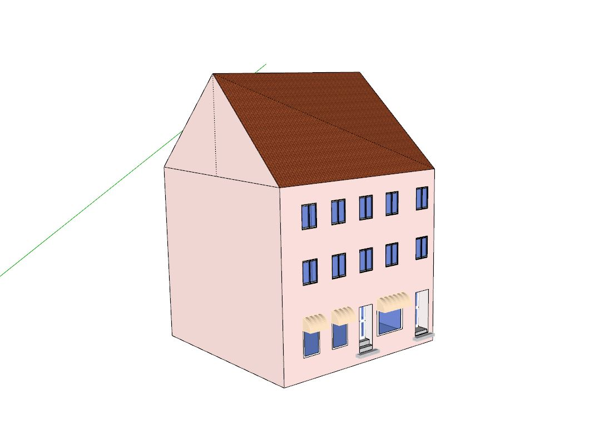

Having all objects created and assigned, you can now collect them into one Building object by selecting all items and grouping them. To the group object you can add attributes (*Right Click-> Attributes -> Edit Attributes*) or paste attributes copied before from LoD1 building (*Right Click-> Attributes -> Paste Attributes*).

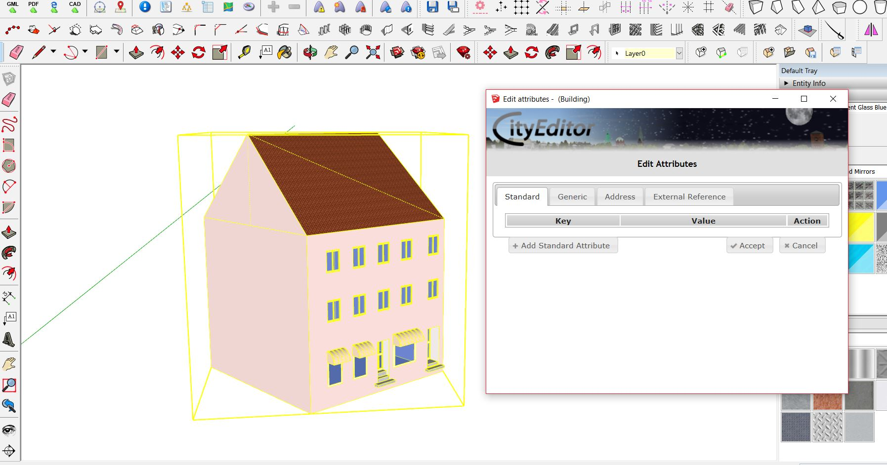

After that, it is important to erase all automatic IDs created within a group to avoid redundant IDs within a model and in comparison with other buildings.
To do that, go to *Attribute Manager* in the main bar of SketchUp. To see all attributes click *Refresh*. You can control your added attributes and check whether the plugin has added something.

Attributes like *PolygonID* and *LinearRingID* should be erased before export into CityGML.

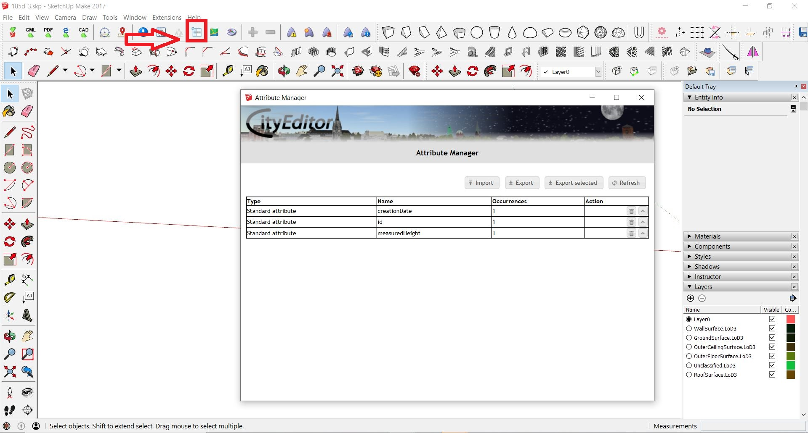

The validation of model structure can be done via Model Explorer located on the main SketchUp bar. Before validation, it is recommended to erase all elements not relevant to the export (e.g. point cloud).
In case of modeling LoD3 object, using MultiSurface geometry and using Building only as container for attributes (not for geometry) the strucuture should be similar to the image below.  

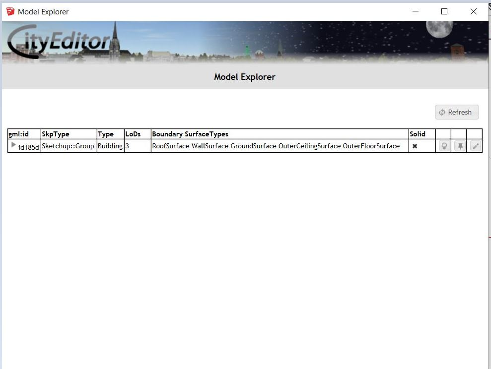

After clicking on the arrow located in the column gml:id, the structure of the object reveals.

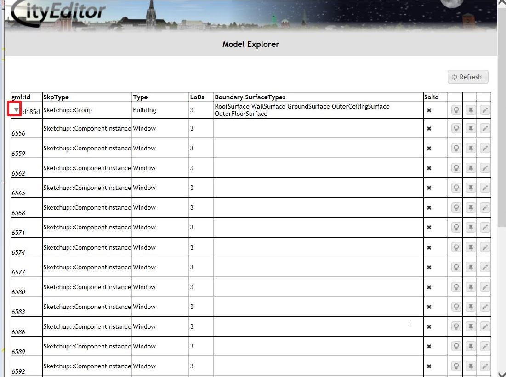

Additional attributes could be added manually to the model using Edit Attributes window. For example, one can add Date of model creation to the edited object (be careful to use right type of date yyyy-mm-dd, i.e. 2019-09-25).

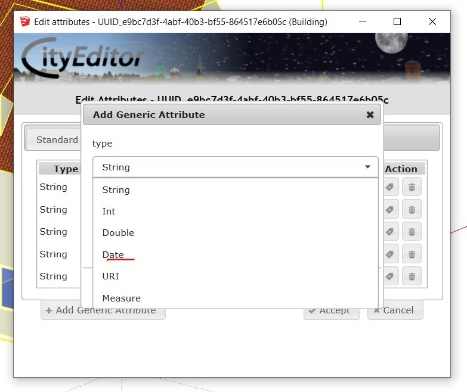

Other possibiltiy to add new attribute, is to use built-in plugin's function. One can access this feature by hoovering on *Attributes* and then *Left Click* on *MeasuredHeight*. This step adds new CityGML attribute with measured realtive height from the finished 3D SketchUp model.  	
	
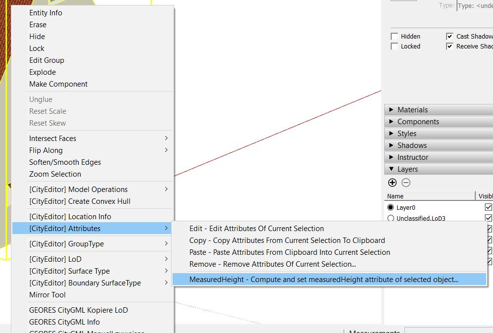

Data export
-----------

To export files, you have to select an icon with green arrow and GML sign and select the folder to save it.

Then, the CityGML Export window is opened. You can tick here *Logging* to see logs while exporting.

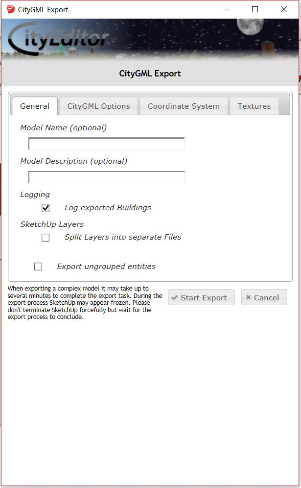

In *CityGML Options* section you make further configuration of exported CityGML. Very important is to type in *Appearance Theme* name and remember it in case of further importing it to citydb or other environments.

As ID for specific Polygons, LinearRings were deleted we have to create them again by ticking option *Generate IDs for all elements* this assures uniqueness. Just to be sure, we can select also *Check and correct IDs* thanks to that exporting algorithm will repair issues if they will appear.

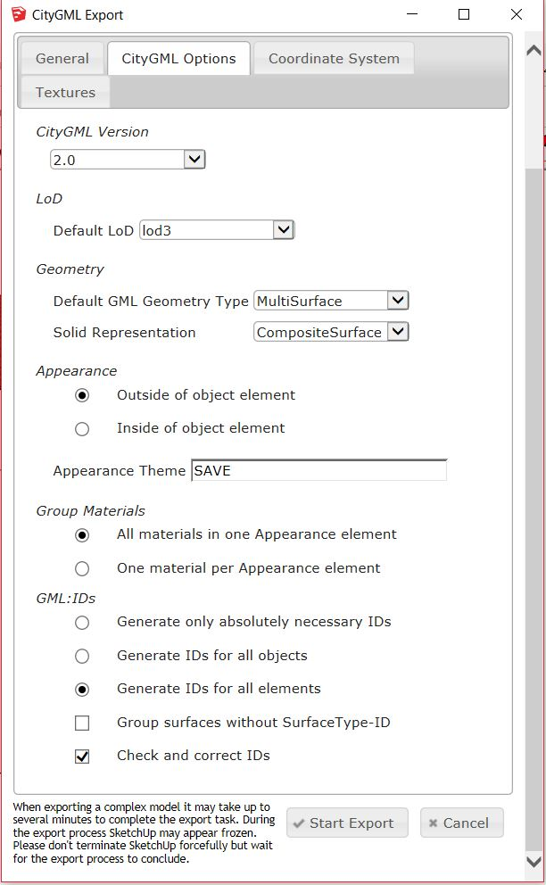

Within section *Coordinate System* you can check whether the coordinate system is appropriate and additionally you can apply *Yaw* (offset). In *Textures* tab you can check currently exporting materials and saving folder for those.

To continue select *Start Export*.

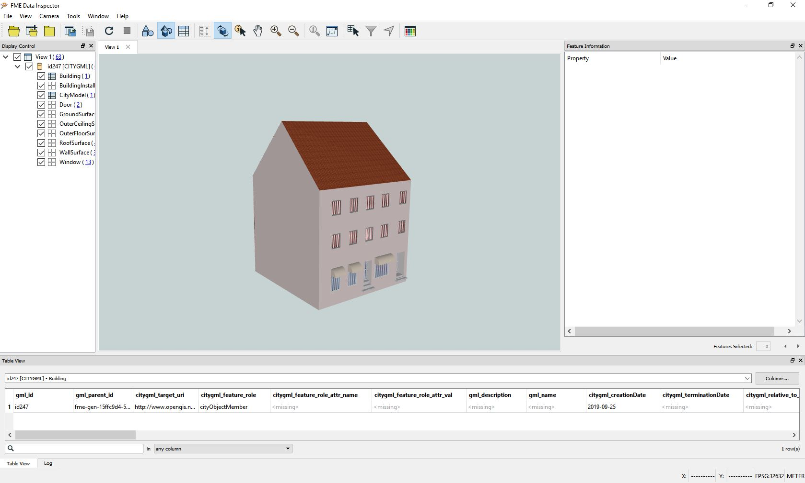
