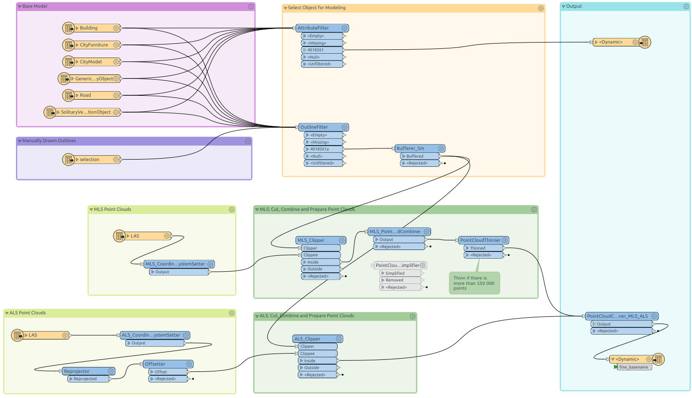

Software
========

In the following the used software is listed and described in more detail.

Feature Manipulation Engine (FME)
---------------------------------

The tool `FME`_ enables the creation of complex data conversion workflows by combining a `multitude of transformers <https://www.safe.com/transformers/>`_ supporting a range of `formats <https://www.safe.com/integrate/>`_.
FME can be used to prepare datasets for manual modeling or even to develop entire workbenches for creating new models.

.. _`FME`: https://www.safe.com/fme/

SketchUp
--------

`SketchUp`_ is a 3D modeling software that is used in areas like architecture, civil engineering and design.
It is actively developed by `Trimble Inc.`_ and offers a wide range of extensions in the `extension warehouse`_.

SketchUp comprises multiple editions:
`SketchUp Free`_ runs in the browser with limited functionality.
`SketchUp Pro`_ is the full-featured and fee-based desktop edition with the ability to install all extensions.

For a lot of use cases SketchUp Make 2017 is an alternative, as it desktop-based and allows the usage of extensions.
Furthermore, it is free of charge and can be downloaded `here`_.

.. _`Trimble Inc.`: https://en.wikipedia.org/wiki/Trimble_(company)
.. _`SketchUp`: sketchup.com
.. _`extension warehouse`: https://extensions.sketchup.com
.. _`SketchUp Free`: https://www.sketchup.com/plans-and-pricing/sketchup-free
.. _`SketchUp Pro`: https://www.sketchup.com/products/sketchup-pro
.. _`here`: https://www.sketchup.com/de/download/all

CityEditor Extension
^^^^^^^^^^^^^^^^^^^^

`CityEditor`_ is developed by 3DIS GmbH and can be installed as SketchUp extension.
It enables SketchUp to import, edit and export CityGML datasets.

CityEditor is offered in a *lite*, *standard* and *professional* version.
Only the *professional* license comprises the functionality of importing point clouds (.xyz, .csv).
A detailed comparison between licenses can be found in this `document`_.

.. _`CityEditor`: https://www.3dis.de/cityeditor/
.. _`document`: https://www.3dis.de/files/cityeditor/produktinformationen/Features_Pricing.pdf?page=7

General Overviews
-----------------

More general software overviews can be found here:

- `citygmlwiki: freeware`_
- `citygmlwiki: commercial software`_
- `TU Delft: Open source`_

.. _`citygmlwiki: freeware`: http://www.citygmlwiki.org/index.php?title=Freeware
.. _`citygmlwiki: commercial software`: http://www.citygmlwiki.org/index.php/Commercial_Software
.. _`TU Delft: Open source`: https://3d.bk.tudelft.nl/code/
